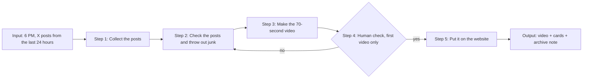

# Workflow diagram: Crypto L2 Daily

```mermaid
flowchart LR
    A[Input: 6 PM, X posts from the last 24 hours] --> B[Step 1: Collect the posts]
    B --> C[Step 2: Check the posts and throw out junk]
    C --> D[Step 3: Make the 70-second video]
    D --> E{Step 4: Human check, first video only}
    E -->|yes| F[Step 5: Put it on the website]
    E -->|no| C
    F --> G[Output: video + cards + archive note]
```

The same five steps are in `process-map.canvas`, in the same order.
